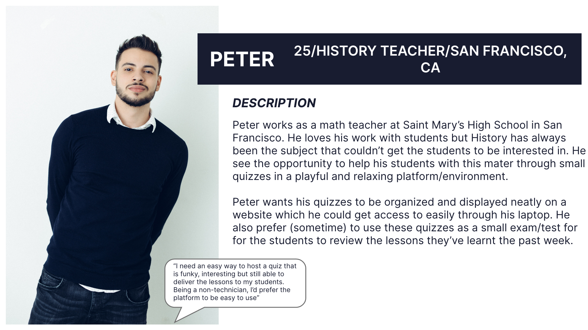

## Analyzing client's requirements

- The key point that the client wants to have in the web app is: "HAPPINESS", quote: "They would open the app, play it and finish it with a smile on their faces"
- It's a similar platform like Kahoot! but different → Finding the USPS for this app, based on an existing platform, but have different features/better features
- The whole process from creating the quiz to host the quiz should be seamless, natural and not obliged or boring

## Strategy and solution proposal

1. The "HAPPINESS" approach
    1. Dig into how to achieve this: The client side and not the developer side. 
        - Ability to customize the quizzes
        - to invite friends regardless of occasions and environments
        - to set up interesting music maybe! videos funny videos
        - To make a competition out of it: leaderboard, score
            - Answer faster, answer better!
        - it could be use for educational purpose
        - In pub: could be drinking game
    2. A sleek, funny design, that light the mood
        - This requires a nice color palette, preferably light, colorful palette
        - Interesting/funky background patterns
        - Boxes and bubbles are rounded and not all rectangles/point corner - reduce the seriousness of the app and increase the amusement, delightment
    3. Extra features that could help the experience better
        - automatic sending invitation through link: this would work!!!
        - QR code that could be scan throughout different portable devices
2. Unique selling points (USPS)
    1. You finish the game without knowing anything but your score. After you answer each question, you don't know whether it's correct or not → build up tensions, make you feel curious and have to answer everything and wait till the end - mysterious
    2. The quiz master don't control your movement - you do. How fast and how slow you are depends on your knowledge, not on the way the quiz master keeps you in the waiting room waiting for other to complete their questions
    3. Timing is key - but it's ok if you don't make it on time. Because even when you run out of time, choose one answer - you might still get point for that if your answer is correct, we've taken care of the scoring system in our end
3. Quiz master perspective - a seamless and descriptive experience
    1. "The process should be natural - i don't like when it's a pops up and you feel like you have to fill in a lot of fields"
        - the look and feels should be natural → should be like a flow, instead of a pops up with many question/answer fields to fill in
        - With a nice way to input the question, the answer.
            - The inspiration could be "headspace app", could be like Reflectly
        - To make it works nicely with the overall design, the adding and editing certain elements could be a full screen or half screen experience, with the ability to toggle between sections
    2. "Websocket wasn't implemented successfully the first time"
        - We focus on synchronization. It means the screens for respondents and quiz master are related and complement each other
        - At the same time, we want to cut down the need of extra screens that are unnecessary (a big screen for waiting room is unnecessary, instead we used spinning/progress indicator, an the same screen but different arrangement and content)

## Drafting Personas and End-users wishes

.
    
.
    
.

## Final High-fidelity prototyping

Color set :

- theme: #181C30 (dark blue)
- light blue: #3099B8
- purple: #522785
- orange: #EC633E
- red: #9A1F40

Requirements for color:

- Consistently subtle: Because the color will be display on a big screen as theme color chosen by the quiz master, they have to be subtle, eyecatching and not confusing.
- The colors have to blend nicely and smoothly with the text → These colors are dark enough to make the texts stand out, but light enough to make the whole set colorful and lively

Requirements for icons:

- They have to be descriptive and meaningful
- They have to come from the same source to enhance the consistency and uniformity

Requirements for fonts and size:

- The font should be funky, can vary from 2-3 fonts in the app. The headings should share the same font with different variation (Bold, regular, semi bold, italic,...) → Roboto or Inter font (for prototyping)
- The text size should be consistent and complement the importance of the text

    The official mockups and design is in the file "HBO-Corp Mockups"