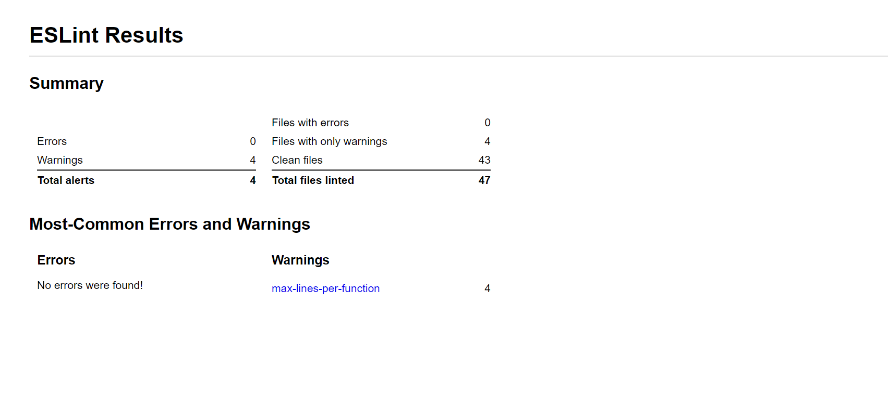
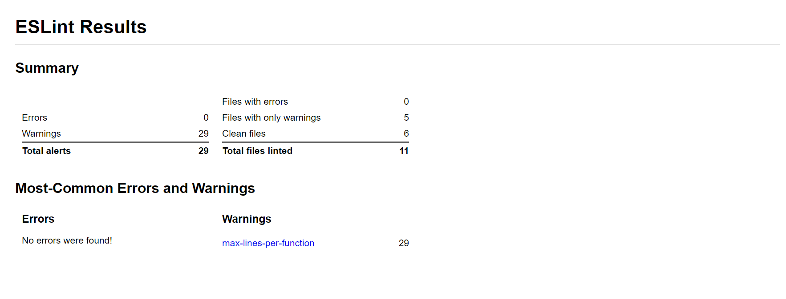

# ESLint

## Why ESLint?

#### Find Problems

ESLint provides quick code analyse, generates a report with problems specification. ESLint can run as a part of continuous integration pipeline.

#### Fix Automatically

Most of the problems can be fixed automatically with only one command. Additionally ESLint is syntax-aware. After fixing, the code is more consistent, there is less bugs.


#### Customize
ESLint is a very helpful tool. When the whole team is working on a particular project and the client want to have structured code. With ESLint it is really easy to provide code styling. 


## Three levels of errors
- "off" - turn off the rule
- "warn" - turn on the rule as warning
- "error" - turn on the rule as an error - exit code will be 1

In this project for all the rules, which can be fixed automatically, the error level is 'warn'. Rules, which cannot be fixed automatically are marked as 'error' (with one exception: max-lines-per-function- we decided to keep it as warning).

## How to run Eslint?
Eslint is running in the background of the application, but if it's necessary, it can be run separetly with scripts:
- `npm run  lint` - to run the ESLint and see all the errors and warnings in the terminal
- `npm run lint:fix` - to fix all the warnings
- `npm run lint:report` - to run ESLint and generate HTML report, which can be find later in `Eslint/report.html`

## Basic settings:
Before the installation, it is necessary to choose basic settings for ESLint:
- ESLint is used to check syntex, find errors and enforce code styling
- There are JavaScript modules (import/export)
- There is Vue.js framework in the project
- There is no TypeScript
- The code runs in :
  - Browser (Frontend)
  - Node (Backend)
- A popular style is used to define a style for the project
- This project follow Standard style
- ESLing configuration file has JavaScript formal  

## All problems after running ESLint with standard styling for the first time

Running Eslint with standard styling was necessary to find and analyze problems, which can be included later in the 'rules'.

| problem  | description of the problem  |  
|---|---|
| indent  |Expected indentation of 4 spaces but found 6|    
| space-before-function-paren  |  Missing space before function parentheses  |  
| key-spacing  |   Missing space before value for key 'quizId'  |    
|  space-before-blocks |  Missing space before opening brace    |  
| quotes  |  Strings must use singlequote  |   
| semi  | Extra semicolon   | 
|  spaced-comment |  Expected space or tab after '//' in comment |  
|   | Parsing error: Unexpected token import  |  
| no-unused-vars  |'ca' is defined but never used     |  
|  object-curly-spacing  | A space is required after '{'    |   
|   object-curly-spacing |  A space is required before '}'  |   
| padded-blocks  |  Block must not be padded by blank lines  |   
|no-async-promise-executor   | Promise executor functions should not be async   |   
|prefer-const   | 'newAnswer' is never reassigned. Use 'const' instead   |   
|keyword-spacing   | Expected space(s) after "try"  ;  Expected space(s) before "catch"   | 
| no-multiple-empty-lines  |  More than 1 blank line not allowed    |  
|   space-infix-ops | Operator '<' must be spaced  |  
|   | Expected space(s) after "if" keyword-spacing  | 
|   | Expected space or tab after // in comment    spaced-comment  |  
| space-in-parens  | There should be no space after this paren   | 
|import/first|Import in body of module; reorder to top  |  
|import/no-duplicates     | imported multiple times  |    
|  comma-spacing | A space is required after ','    |   
|   comma-dangle |  Unexpected trailing comma   |  
|   semi-spacing |   Unexpected whitespace before semicolon  |   
| no-dupe-keys|  Duplicate key 'animations'  |
|camelcase|Identifier 'quiz_id' is not in camel case.|
|handle-callback-err|Expected error to be handled.|
|no-throw-literal|Expected an error object to be thrown.|

## Example of correct syntax for rules used in this project:

1. Indent - 2-space(one tab) indentation

 ```sh 
 if (a) {
   b=c;
   function foo(d) {
     e=f;
   }
}
 ```

2. space-before-function-paren -
```sh
function withoutSpace(x) {
    // ...
}
```


3. key-spacing

```sh
var obj = { "foo": 42 };
```

4. space-before-blocks - block has at least one preceding space


```sh
if (a) {
    b(); 
}
```

5. quotes
```sh

var single = 'single'; 
```
6. semi

```sh
var name = "ESLint"
var website = "eslint.org";
```

7. spaced-comment
```sh
//This is a comment

```
8. camelcase
```sh
var myFavoriteColor   = "#112C85";

```

9.  object-curly-spacing - before/after
```sh
var obj = {'foo': 'bar'};
```

10.  padded-blocks 
```sh
if (a) {
    b();
}

```
11. keyword-spacing

```sh

if (foo) {
    //...
} else if (bar) {
    //...
} else {
    //...
}

```

12. no-multiple-empty-lines - default -max 2 lines between

```sh
var foo = 5;

var bar = 3;
```
13. space-infix-ops - before/after
```sh

a + b
const a = {b:1};
```

14. space-in-parens - before/after
```sh

foo('bar');
var x = (1 + 2) * 3;
```

15. comma-spacing 
```sh
var foo = 1, bar = 2;
```

16. comma-dangle
```sh
var foo = {
    bar: "baz",
    qux: "quux"
};
```
17. semi-spacing - before/after
```sh
var foo;
var foo; var bar;
```

18. no-lonely-if
```sh

if (foo) {
    // ...
} else if (bar) {
    // ...
}

```

19. no-whitespace-before-property
```sh

foo.bar
```

20. eqeqeq

```sh
a == b
foo == true
bananas != 1

```

21. no-async-promise-executor
```sh
const foo = new Promise((resolve, reject) => {
  readFile('foo.txt', function(err, result) {
    if (err) {
      reject(err);
    } else {
      resolve(result);
    }
  });
});

const result = Promise.resolve(foo);
```

22. prefer-const
```sh
const a = 0;

// it's never initialized.
let a;
console.log(a);
```


### Styling options, which cannot be fixed automatic 
| problem  | example of the problem  |  
|---|---|
|max-lines-per-function |Function has too many lines (26). Maximum allowed is 20 |
| camelcase |Identifier 'short_name' is not in camel case  |
|no-unused-vars |'uuidv4' is defined but never used   |
|  prefer-const |'outObject' is never reassigned. Use 'const' instead   |
|no-undef |'e' is not defined |
|no-throw-literal|Expected an error object to be thrown.|
|eqeqeq|Expected '===' and instead saw '=='.|
|handle-callback-err|Expected error to be handled.|
|no-async-promise-executor|Promise executor functions should not be async |

### Rules which are off
`capitalized-comments` - we decided to turn off this rule, because some of the comments include small letters at the beginning of the line. Sometimes we use 'enter' in the middle of the sentence, to make the comment shorter and easier to read. 


## End results:
Everyone has own programming style, we decided to use `Standard JavaScript Style` for the first `ESLint` checking. ESLint discovered more than 4000 errors and warnings. Based on the output, we made a list of rules, which we want to follow and we configured them. Most of the errors and warnings could be fixed automatically, but around 200 of them, we had to solve manually. 
In the final version of the application there are still:
- in the frontend part:



Four of the methods are too long. Those method are used to get or update data and it's difficult to make them shorter.

- in the backend part:



It wasn't required to have max 20 lines of code in every method in the backend, but we tried to do it. However in most of the API calls we need to use few API requests, which makes every method complex. We could try to divide every method into few separate functions, but it was complicated for us to connect with Parantion's backend and providing extra functions, would break our connection.

## Improvement 

ESLint is a powerful code analysis tool, which covers code quality and code styling issues. ESLint supports so many rules, which can be customized in many ways. 
In this project we covered the most popular styling for JavaSpript. As I mention before, everyone writes code in different way,that is why the ESLint configuration should be structured according to personal styling. 
To customize the rules, go to `.eslintrc.js` and change the settings of a rule. The whole list of rules can be find: `https://eslint.org/docs/rules/`.

What is more, it is possible to declare which files should be checked and which shouldn't. To ignore a file, just add the file's path in `.eslintignore`.

To ignore a part of a code, it is necessary to provide a comment before the code, with the rules which shouldn't be executed by ESLint. For example to skip one of the methods use: 
```sh
//eslint-disable-next-line max-lines-per-function
```

Right now it is necessary to use a command to `fix` issues automatically. It is possible to do it without command, for example every time when the code is saved. There are extension which can do it automatically, for example `VS Code ESLint extension`.