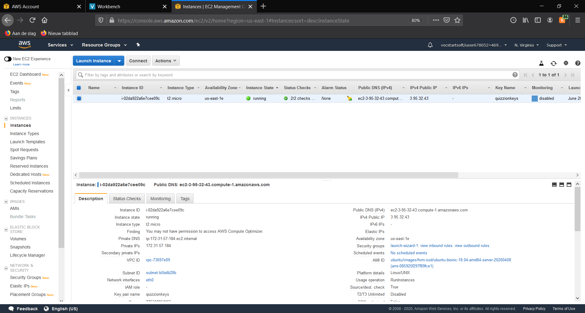
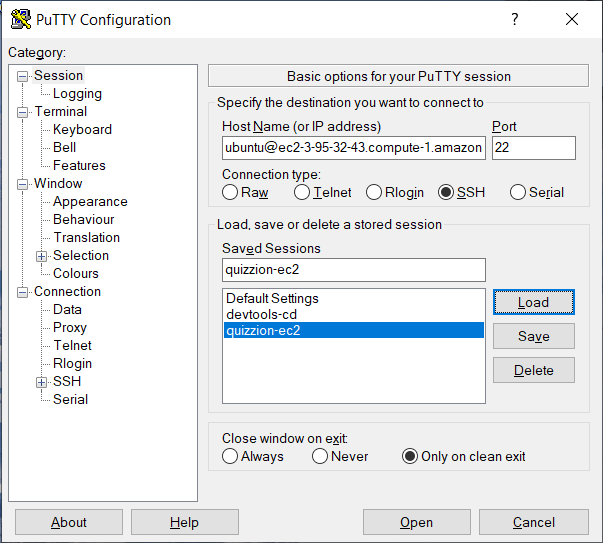
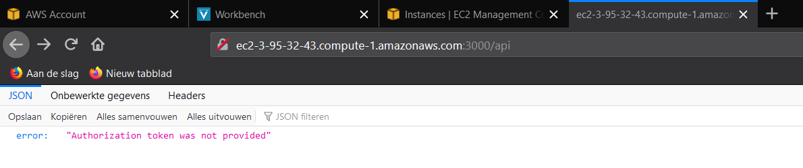
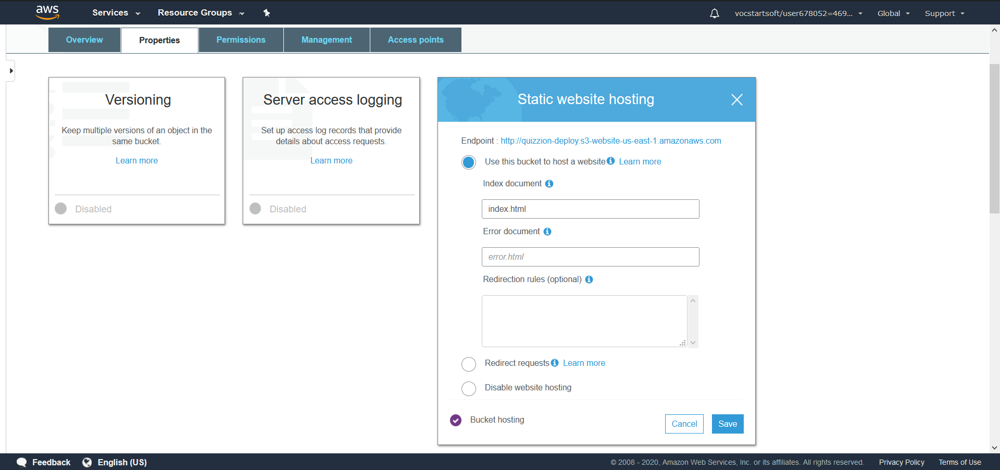
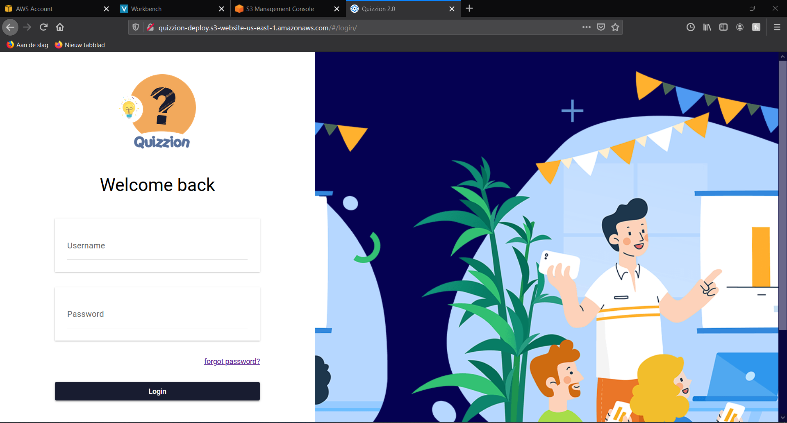

# Hosting manual

Here we will describe all the steps taken to achieve hosting the backend on an AWS EC2 instance, and the frontend on an AWS S3 bucket.

[TOC]

### Backend

This chapter goes over all the details about hosting a Node.js + Express API on AWS.

#### Used service

The service we use to host our backend is called 'EC2'. This means **E**lastic **C**ompute **C**loud, and it is a service to provide compute capacity in a scalable and secure way. In our situation it basically comes down to being a virtual machine, running on an AWS cluster instead of one of our own machines.

#### Setup

Setting up an EC2 instance is rather easy, given you have some basic command line experience. In this paragraph we will go over the steps and show how to apply some settings or run some commands, to achieve the desired end result.

##### Creating the instance

The obvious first step is to login to the AWS Console and find the EC2 service. On the EC2 page you will find a broad overview of all EC2 resources, and some more detailed links to documentation or specific pages.

There should be an orange button labelled 'Launch instance'. Clicking it will start a walk through of some pages where you will be able to configure your instance.

On the first screen you have to pick an 'AMI', or **A**mazon **M**achine **I**mage, which is a template that contains the software configuration required to launch the machine. This includes for example the OS and preinstalled applications. In our case we went for the Ubuntu 18.04 AMI, as this felt the most familiar.

The next screen is about choosing an instance type, basically the specs of your instance. We chose the t2.micro General Purpose instance, since this one is eligible for the free tier, and we don't expect to be needing a lot of CPUs or memory.

Most of the setup is done now, we can leave a lot as just the default settings, but there is one important step left, which is about the 'Security Group'. This is a set of firewall rules that control the traffic for our instance. We want to be able to access this machine on port 3000, for the API, and on port 22 for the SSH connection we will setup later. The setup of this security group is pretty straight forward, you specify ports and the IP ranges you want to allow access to these ports.


The final step after you configured and reviewed the instance, is generating a key pair. This can be done in the pop up dialog that is shown after pressing 'Launch'. You can chose to use an existing key pair, or generate a new one, which is what we did. It will automatically download a file called `keyname.pem` to your device. After this you should be able to see your instance running like so:



##### Connecting to the instance

Now that the instance is running, we want to connect to it so that we can deploy our backend on it. Depending on prior experience this might be either the easiest or hardest step.

We did this via a windows machine, and the steps are a bit different for other OS', so for reference or further explanation click [here](https://docs.aws.amazon.com/AWSEC2/latest/UserGuide/AccessingInstances.html?icmpid=docs_ec2_console).

For windows, you can use the well known SSH client 'PuTTY'. The first step would be to convert the `key.pem` file to a `key.ppk` file, because PuTTY uses a different key format. This can be done with PuTTYgen, just load the .pem file in the convert tab, and then press 'Save private key'.

Now we can open PuTTY again, and connect to the instance. In the Session tab, input the host name as `instance-user-name@instance-public-dns`. The user name depends on which AMI you chose during the setup, for ubuntu it is just `ubuntu`, and for others click [here](https://docs.aws.amazon.com/AWSEC2/latest/UserGuide/connection-prereqs.html#connection-prereqs-get-info-about-instance).

In our case, this host name comes out to:

​		`ubuntu@ec2-3-95-32-43.compute-1.amazonaws.com`

Make sure you select port 22 and the SSH connection type.



Finally you should navigate to 'SSH' and then 'Auth' in the Category tab on the left. Here you will find a file browser field where you should upload the `key.ppk` file from before.


Before pressing 'Open' it might be nice to press 'Save' in the Session tab to save this session, this makes it easy to connect in only a couple clicks in the future.

##### Running the application

When you are connected to the instance for the first time, there will be nothing on there. Since we want to run a Node.js application, we should first install Node. This can be done by running these 2 commands:

1. `curl -sL https://deb.nodesource.com/setup_12.x | sudo -E bash -`

2. `sudo apt-get install -y nodejs`

To verify you have Node.js and NPM installed correctly you can run `node -v` and `npm -v`.

Now we just need to get the backend code on the instance. We can do this by cloning the git repo, but there are also options. 

You can run `sudo apt-get install git` to install git, and then `git clone https://gitlab.com/organisation/projectname.git`

After inputting username and password the repo should be cloned onto the instance. To check you can run the `ls` or `ll` command.

If needed you can check out the correct branch, in our case 'develop'. Navigate to the correct folder and run `npm install` to install all the dependencies of your project. After that, you can run the start script to run the application!

#### End Result

You should now be able to access the API by copying the 'Public DNS (IPv4)' field on the running instances page in your console, and appending it with :3000 in the URL bar of your browser.  If you get an error, it is likely that there is something wrong with the inbound traffic rules. To change these you should navigate to the 'Security Groups' tab.

In our case, going to `http://ec2-3-95-32-43.compute-1.amazonaws.com:3000/api` yields:



This is the expected response for a GET request to this URL, so we know the request is correctly received and handled by the backend.

#### Improvement

One improvement we would definitely make for more long term use, would be to install some production manager, such as PM2. This will make sure the server keeps running, even after you closed the SSH session with the instance.


### Frontend

This chapter goes over all the details about hosting a Quasar-Vue frontend on AWS.

#### Used service

We used a storage service called 'S3'. S3 storage can be used for a wide variety of things, such as storing code, logs, normal files or hosting a static website. There are definitely other options for hosting a website, even within AWS, but the simplicity of S3 is why we chose it.

#### Setup

The setup is very simple. All you need to do is click through a setup wizard and chose the correct configuration and permissions.

##### Creating the bucket

Find the S3 service in the AWS Console and click 'Create bucket'. Enter a name, which needs to be DNS-compliant, which means it can not have uppercase letters and underscores. It also must not start or end with a dash or period.

Click next and enable versioning or logging as you wish, then press next again. Make sure you *disable* blocking of public access. The bucket should become public, as this is the only way people will be able to visit the frontend.

Create the bucket, and navigate to it via the buckets overview.

There should be a tab labelled 'Properties'. There will be an option to enable static website hosting, enable that by selecting 'Use this bucket to host a website', and type `index.html` under the Index document. Save and go to the 'Permissions' tab next.



The only step left is to change the 'Bucket Policy'. This can done in the `Permissions > Bucket Policy` tab We want to allow anyone to read the files in this bucket (, even though there are none, yet). The policy we used was as follows:


````json
{
    "Version": "2012-10-17",
    "Statement": [
        {
            "Sid": "PublicReadAccess",
            "Effect": "Allow",
            "Principal": "*",
            "Action": "s3:GetObject",
            "Resource": "arn:aws:s3:::your-bucket-name/*"
        }
    ]
}
````

(Replace `your-bucket-name` with the name you chose for the bucket.)


##### 'Deploying' the website

The bucket is configured to host a static website, it can not 'run' any npm script. To generate the static files, we can use the `quasar build` command, which generates a `dist/spa/` folder.

The final step is to put the static files inside the bucket. This can all be done via the GUI by clicking upload and selecting the files, or dragging the files directly to the screen.

#### End result

You should now be able to view the frontend by copying the URL in the `Properties > Static website hosting` screen. 

In our case, going to `http://quizzion-deploy.s3-website-us-east-1.amazonaws.com/#/` yields:



This is the login screen which is the landing page as long as you are not logged in.

#### Improvement

Each time we want to deploy some changes, we need to manually run `quasar build` to generate the static files, then delete the old files from the bucket and publish the new ones. This is obviously not ideal, especially long term. For quick 'prototypes' such as our application, this is a nice solution to let the client or end users interact with the product very quickly.

To improve this we could look at writing a small bash script on the EC2 backend instance, which automatically pulls the latest changes, builds the static files and pushes those to the S3 bucket using the AWS S3 CLI.

Another option which could improve the deployment of both front- and backend, is using AWS CodeDeploy, this could be implemented with the CodePipeline service we are already using for continuous integration. 


