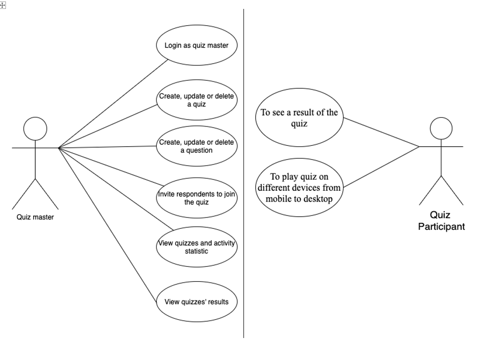

# Functional design

### Table of contents

1. [Background](#1-background) 
2. [Functionalities and features](#2-functionalities-and-features)
3. [Use case diagram](#3-use-case-diagram)
4. [Mockup & wireframes](#4-mockup--wireframes)

### 1. Background
The “Quizzion” is already an existing application that was developed recently by another team of developers. 
Now the owner of the company wants to have a newly created application with the same purpose but with a few different requirements. 
There’s already an existing database in a combination of APIs and documentation on how to use is given by the company. 
The topics to improve from a previous version: design, functionality, animation.   

The new version of the app is expected to be finished in 8 weeks. In this project there’ll be three sprint stages: 0,1,2,3; 
During the 0-stage team will focus on the proper list of requirements, mockups. 
1st sprint is about frontend implementation - connection to the vuex and also starting with the backend. 
At the 2nd sprint, we’ll fully connect frontend to the backend and will add some tests to verify that everything works as expected.
In the last sprint, we will finalize the projects with some refinements and 20% tasks. 
### 2. Functionalities and features
#### Quiz master can:  

1. log in with:
 
       a. Username 
       b. Password 

2. create a quiz: 

        a. Add a name of the quiz 
        b. Add a description of the quiz 
        c. Choose a color of the quiz 
        d. Add a logo to a quiz 
        e. Add questions: 
            e.1. Write the question 
            e.2. Add all possible answers 
            e.3. Declare the correct answer 
            e.4 Add an image to a quiz 
            e.5. Set time for every question 
            c.6. Save question  

3. edit a quiz 

4. invite another people to join a quiz  
(sending link or showing QR-code) 

5. customize the quiz 

        a. Change colors 
        b. Add own logo 

6. See a podium screen 

7. See a statistics page 

#### Respondent can:  
1. participate a quiz 

#### Both respondent and quiz master can: 
1. review the results of the quiz 
### 3. Use case diagram

### 4. Mockup & wireframes
Refer to the mockup document under the file name: [Mockup.pdf](Mockups.pdf) 