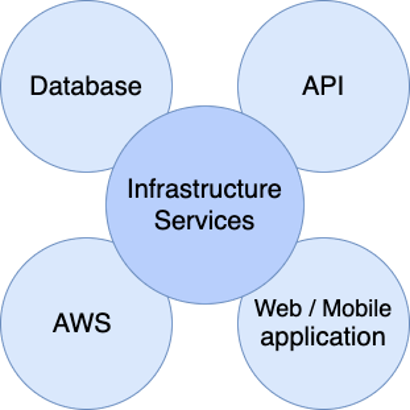
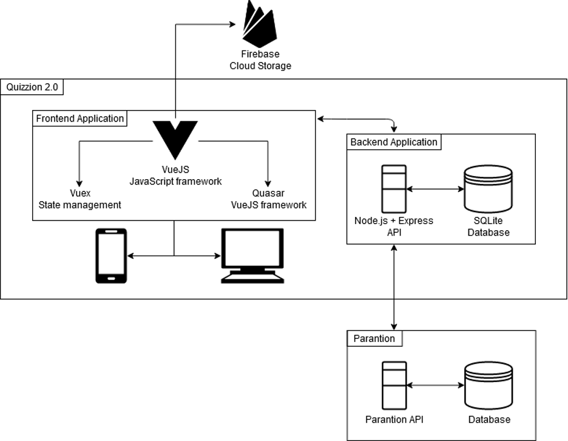

# Technical design

_Team Dev-a6-01_

# Table of Contents

**[1)](#_Toc41927036)** **Infrastructure services**

**[2)](#_Toc41927038)** **Required system software** 

**[3)](#_Toc41927039)** **Component diagram** 

**[4)](#_Toc41927040)** **Relevant information regarding security, scripting, backups and monitoring** 

**[5)](#_Toc41927041)** **CI (Continuous integration)** 

**[6)](#_Toc41927041)** **API documentation** 

**[7)](#_Toc41927041)** **Our own database** 

# 1. Infrastructure services

**Infrastructure Services-** fundamental information technology resources under which applications will be built.

**AWS** – finally for the continuous integration/deployment we&#39;re going to use AWS services. There&#39;re a lot of different services that we can use, but for this project we will use AWS for testing efficiency purposes as well.

**Web / Mobile application** – The final product must be available on the devices with different screen sizes from mobile phones screen to laptop screens.

As a visual representation of what we have built, we have made this high level application overview.

The backend of Quizzion will serve as a layer between our frontend and the already existing Parantion backend. This means that it will make API calls to Parantion on behalf of our users. On top of this, the Quizzion API will also add some additional features such as the features needed for playing live quizzes with websockets.

To exchange information between the frontend and backend, we use the well knows http client Axios for requests, and a library called Socket io for the real-time communication during quizzes.

The latest addition to our infrastructure was the use of Firebase. We wanted to store images, and we had explored different ways of doing that, but in the end we found that the easiest solution would be to set up a cloud storage service. Because of prior experience and an approaching deadline, we chose to go for the easiest solution in our opinion.

# 2. Required system software

During the development of Quizzion, there are different software applications or platforms that we use. In this chapter we will explain what they are and what we used them for.

## Gitlab

A key element in software development the use of a version control system such as gitlab. We use gitlab to allow better collaboration, and prevention of loss of work. Our gitlab environment was created by the teachers of the ACT School of Saxion, but we set up some extra configuration which we will go over now.

The first thing we did was set an approval rule for merge requests. The idea behind this is that before any progress made by a team member is merged into the main working branch, it is first approved by, at least, one other team member. This improves code quality and prevents bugs. We also used a &#39;develop&#39; branch, which served as a step between the individual branches and the master branch.

We also make use of gitlab&#39;s SCRUM-features such as issue boards, burndown charts and milestones. This helped us to visualise progress both during and after each sprint. Starting in sprint 2 we also tried to estimate the workload of each issue.

## Vue.js

As specified in the initial assignment, we use the JavaScript frontend framework &#39;Vue&#39;. Vue is one of the most popular frameworks, along with React and Angular. There are some specified preferences by Parantion, which we keep in mind during development.

The Vue framework has a variety of features that can be used if they are configured right. We made use of the VueRouter, and Vuex. The router allows us to have different endpoints with different pages. This is an important feature since the application has different sides for the moderator and respondents. Vuex is a statemanager. It keeps track of all the data that is showed throughout the application, it is a `single source of truth&#39;. This makes synchronisation different components and pages a lot easier.

## Quasar

Quasar is a framework made specifically for Vue applications. It comes with pre-made components that are customisable and responsive. We set up the project with the Quasar CLI, instead of setting up a project with the Vue CLI and adding quasar later on. Quasar pre-configures a project with the VueRouter and Vuex, as well as different directories for pages, components and layouts. Quasar allows us to use different layouts for different pages. This makes it easy for us to have different layouts of the moderator screens and the respondent screens. Quasar generates a configuration file, which allows us to easily use some plugins or icon libraries. We made use of this to keep the design consistent.

## ECMAscript 6

Vuejs can be written in JavaScript or TypeScript, we chose to go with JavaScript because we are used to it. We use the ES6 specification of JavaScript (for Vue) because it has some new features over the CommonJS specification. The features we benefitted from include:

- Import/export syntax for named imports.
- Promises for handling application flow (used in vuex).
- Template literals for readability.
- Arrow functions which are very helpful in Vue components.
- Spread syntax for easier vuex and backend communication.
- 
## Amazon Web Services

AWS is a very broad cloud platform, which offers a multitude of services. We were tasked to explore a little on this platform, and give some recommendations to Parantion based on our findings. We explored a variety of services, such as: CodePipeline, CodeBuild, EC2 and S3. More explanation on these can be found in their separate documents (hosting-manual.pdf &amp; ci-manual.pdf).

We have access to free student accounts, but unfortunately there are not that many tutorials that use these accounts. Combined with some limitations that are on student accounts(, such as IAM restrictions), it is difficult to figure some things out. This is amplified by the fact that not many (none) of us have a lot of experience with cloud platforms such as AWS or Azure.

## Parantion API

We have to build our application on top of the existing Parantion API. This makes us very dependent on their software. Even though it makes some things like authorisation a bit easier, it is not ideal to use an external API, since we can not control it and don&#39;t have full understanding of it. To prevent issues we need to stay in close contact with the client. The documentation is available to us [here](https://lab.dev.easion.nl/backend/api/doc).

# 3. Components diagram

# 4. Relevant information regarding security, scripting, backups

- Security:
  - Each request to API will be made using OAuth2 access tokens
  - Passwords will be stored encrypted under md5 hashing algorithm
  
- Scripting:

  1. Eslint:
  - `npm run lint` - to run eslint 
  - `npm run lint:fix` - to fix errors/warnings from eslint
  - `npm run lint:report` - to run eslint and get HTML report, which can be find in `eslint/report.html`
  
  2. Tests:
       A) Frontend tests    
         - `npm run test` - this script will tell you to look in package.json to see more specific test scripts.
         - `npm run test:unit` - runs unit tests with the `updateSnapshot` flag.
         - `npm run test:coverage` - runs unit tests and generates a report on code coverage
         - `npm run unit:watchAll` - watches files and runs test each time there is changes
         - `npm run serve:test:coverage` - serves the coverage report
         - `npm run concurrently:dev:jest` - runs both the dev server and jest with the `watchAll` flag at the same time.
         - `npm run test:unit:ui` - runs the Majestic GUI for unit tests on port 4000
         - `npm run test:e2e` - runs the cypress GUI for end to end tests
         - `npm run test:e2e:CI` - runs the cypress end to end tests in the headless electron (command line) browser. Useful for CI.
  
       B) Backend tests
          - `npm run start` - to run a backend 
          - `npm run test` - to run all the mocha tests
          - `npm run watch` - to run a backend and each time there's a change it'll be updated 
          - `npm run doc` - to generate a document explanation about a backend
          - `npm run lint` - to run lint test
          - `npm run lint:fix` - fixes all lint troubles that were found during linting 
          - `npm run lint:report` - generates a report on a lint commands 
           
- Backups:
  - Currently, we're using gitlab.com for our project and inside of it we have a branch called &quot;develop&quot; where usually each sprint arrives data from different branches to have a complete application according to the different sprints (0,1,2).

# 5. CI (Continuous integration)
    
- CI: can be found in docs/system dossier/manuals/aws_pipeline

# 6. API documentation

- The latest version of our API documentation could be found in  src/backend/apidoc/index.html.

# 7. Our own database

-   
